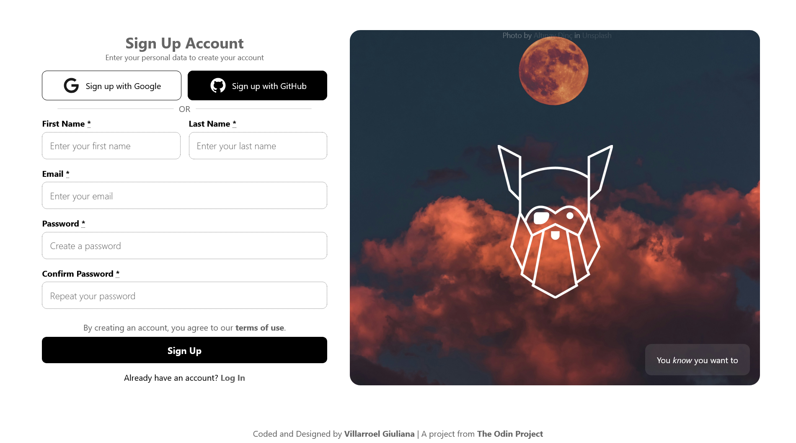

# ✨ Sign Up Form Project ✨

A responsive sign-up page with modern design and accessible markup, built as part of The Odin Project curriculum.



## 📋 About The Project

This project is a practice exercise from [The Odin Project](https://www.theodinproject.com/) focused on creating a fully responsive registration form. The challenge emphasizes semantic HTML, CSS best practices, and accessibility standards.

The page features a dual-section layout with an eye-catching hero image and a comprehensive registration form, including social authentication options and proper form validation attributes.

## 🛠️ Technologies Used

-   **HTML5**
-   **CSS3**
-   **BEM Methodology** - For organized and maintainable CSS class naming

## 📁 Project Structure

```
sign-up-form/
│
├── index.html          # Main HTML structure
├── css/
│   └── style.css       # Stylesheet with mobile-first responsive design
├── img/
│   ├── bg.jpg          # Hero background image
│   ├── odin-logo.png   # The Odin Project logo
│   ├── google-logo.svg # Google authentication icon
│   ├── github-logo.svg # GitHub authentication icon
    └── preview.png     # Preview image
└── README.md           # Project documentation
```

## 🎨 Features

-   ✅ Fully responsive design (mobile, tablet, and desktop)
-   ✅ Accessible form with semantic HTML
-   ✅ Social authentication buttons (Google and GitHub)
-   ✅ Form validation attributes
-   ✅ BEM naming convention for CSS
-   ✅ Modern UI
-   ✅ Smooth hover transitions and interactions

## Assets and Credits

### Images

-   **Background Photo**: [Altınay Dinç](https://unsplash.com/@adinc) on [Unsplash](https://unsplash.com/photos/LluELtL5mK4)
-   **Logo**: The Odin Project

### Icons

-   <a target="_blank" href="https://icons8.com/icon/60984/google">Google Logo</a> icon by <a target="_blank" href="https://icons8.com">Icons8</a>
-   <a target="_blank" href="https://icons8.com/icon/62856/github">GitHub</a> icon by <a target="_blank" href="https://icons8.com">Icons8</a>

## 💡 What I Learned

-   Creating accessible forms with proper semantic HTML
-   Implementing responsive layouts with Flexbox
-   Using CSS custom properties for maintainable styling
-   Applying BEM methodology for scalable CSS architecture
-   Building mobile-first responsive designs
-   Handling form validation with HTML5 attributes

## 🚀 Live Demo

[View Live Demo](https://gvillarroel-dev.github.io/sign-up-form/)

## 👩‍💻 Author

**Designed and Coded by:** Villarroel Giuliana

-   GitHub: [@gvillarroel-dev](https://github.com/gvillarroel-dev)

## 🎓 Acknowledgments

This project was proposed by [The Odin Project](https://www.theodinproject.com/) as part of their web development curriculum to promote learning by doing.

---

_Note: This is a practice project. The form doesn't actually create accounts._
